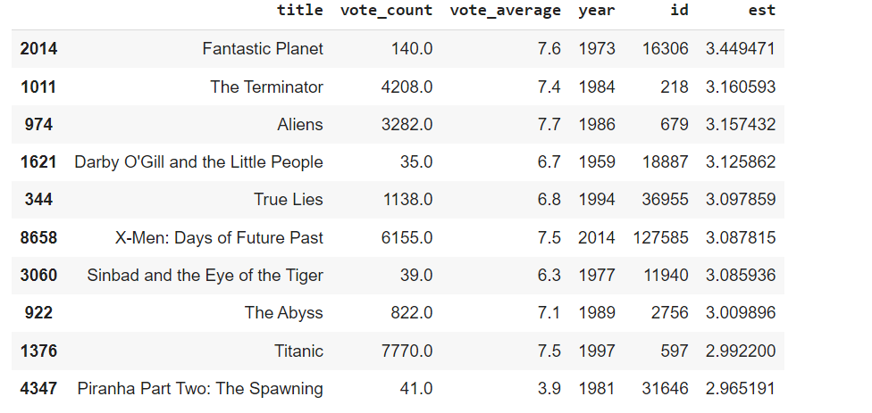

# Movie theme recommender
 A movie theme recommender can be built using a hybrid filtering approach that combines content-based filtering and collaborative filtering.
 During the preprocess of the data first we need to convert the textual data into vectors.
 
 Content-based filtering recommends movies based on their similarity to other movies in terms of features such as genre, cast, director, and plot summary, here we use SVM to make the model or cosine similarity.
 
 Collaborative filtering recommends movies based on the preferences of similar users. A hybrid approach combines the strengths of both methods to improve the accuracy and coverage of the recommendations.Here e use SVD and cross validation to make prediction.

 Combinig these two filtering approaches we get the hybrid Filtering approach. Hence the output of hybrid Filtering as follow:-

 

